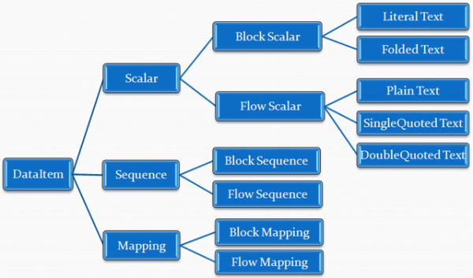

# YAML Parser in C#

The YAML part of this collection of C# utility is copied from an article published by [Junfeng Liu](https://github.com/J-F-Liu) in Code Project. Reference [here](https://www.codeproject.com/Articles/28720/YAML-Parser-in-C)

Here is a copy of the article below

------

An almost feature complete YAML parser

## Introduction

YAML is a human-friendly, cross language, Unicode based data serialization language designed around the common native data types of agile programming languages. It is broadly useful for programming needs ranging from configuration files to Internet messaging to object persistence to data auditing.

Visit the [official YAML website](http://yaml.org/) for more information.

## YAML Basics

A YAML file may contain zero or more YAML documents, separated by document markers. A YAML document contains one root `DataItem`. There are three types of `DataItem`s: Scalar, Sequence, and Mapping. `DataItem`s may be nested to form structured data.

Each `DataItem` type has several formatting styles for good human readability.



Some rules:

- A block style item can be nested to a block style item but not a flow style item.
- A flow style item can be nested to either a block style or a flow style item.
- Block structure is denoted by indentation.
- All indentations only use space char, tab is not allowed.

Here are some examples:

#### Block Scalar

Literal Text

| `Copy Code| The text using literal style.` | `Copy Code|- The text using literal style.` |
| ------------------------------------------ | ------------------------------------------- |
| "The text using\nliteral style.\n"         | "The text using\nliteral style."            |

Folded Text

| `Copy Code> The text using folded style.` | `Copy Code>- The text using folded style.` |
| ----------------------------------------- | ------------------------------------------ |
| "The text using folded style.\n"          | "The text using folded style."             |

Flow Scalar

| `Copy CodePlain Text`           | Can not start with `,[]{}#&*!|>'\"%@``Can start with `-?:` followed by non space char"`:` " and "` #`" cannot appear in between |
| ------------------------------- | ------------------------------------------------------------ |
| `Copy Code'Single Quoted Text'` | Line breaks are folded"`'`" is escaped with "`''`"           |
| `Copy Code"Double Quoted Text"` | Line breaks are foldedEscape sequences can be used           |

Sequence

| Block Sequence | `Copy Code- Item one - Item two - Item three` |
| -------------- | --------------------------------------------- |
| Flow Sequence  | `Copy Code[Item one, Item two, Item three]`   |

Mapping

| Block Mapping | `Copy CodeKey1: Item one Key2: Item two ? Key3 : Item three ` |
| ------------- | ------------------------------------------------------------ |
| Flow Mapping  | `Copy Code{Key1: Item one, Key2: Item two,  Key3: Item three} ` |

#### Other

Anchor and Alias

| `Copy CodeKey1: &items  A: Item A  B: Item B Key2: *items` | `Copy CodeKey1:  A: Item A  B: Item B Key2:  A: Item A  B: Item B` |
| ---------------------------------------------------------- | ------------------------------------------------------------ |
|                                                            |                                                              |

Comment

```
Copy Code# whole line comment Data Item # inline comment
```

## Background

There is already a [Yaml Library for .NET](http://yaml-net-parser.sourceforge.net/) project, but the features supported are limited

## Using the Code

The parser code is generated using a homemade tool based on grammar specified in the *YAML.PEG.txt* file. This grammar is not completely equal to the [official YAML specification](http://yaml.org/spec/1.2/). Here are some differences:

- A separator “**`,`**” is not allowed following the last entry of Sequence or Mapping in this parser. The 32-bit Unicode escape sequence “`U`” (ns-hex-digit × 8) is not supported

The parser can be used like this:

```
Copy CodeYamlParser parser = new YamlParser();
TextInput input = new TextInput(File.ReadAllText(yamlFilePath));
bool success;
YamlStream yamlStream = parser.ParseYamlStream(input, out success);
if (success)
{
    foreach (YamlDocument doc in yamlStream.Documents)
    {
        // access DataItem by doc.Root
    }
}
else
{
    MessageBox.Show(parser.GetEorrorMessages());
}
```

Or:

```
Copy CodeYamlStream yamlStream = YamlParser.Load(yamlFilePath);
```

## Points of Interest

The main shortcoming of this parser is that error messages are not intuitive. You are welcome to give suggestions

# Aside: Link a Whole Tree of Source Files in a Visual Studio Project

As source for the YAML library is split onto many files themselves in subdirectories, it appeared not obvious to include them as *links* in a Visual Studio project

Here is one way to achieve this adding this inside <ItemGroup> tag of the `.csproj` configuration file:

    <Compile Include="..\src\yaml\**\*.cs">
      <Link>YAML\%(RecursiveDir)%(FileName)%(Extension)</Link>
    </Compile>
where `..\src\yaml` is the relative path to the real file and `YAML\` is the virtual folder we want to appear in the project tree